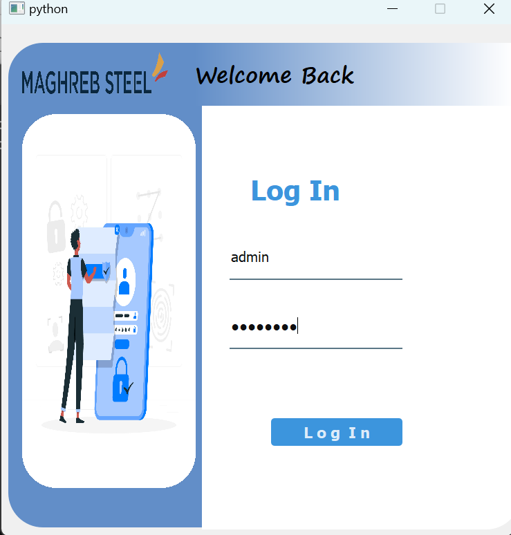
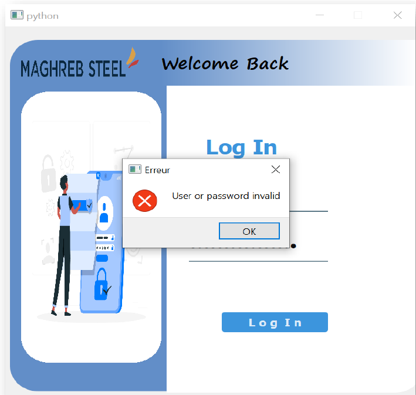
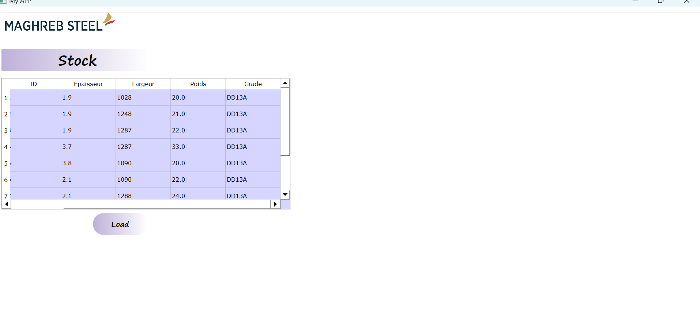
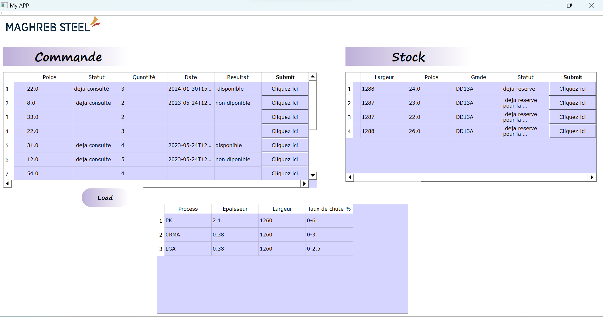
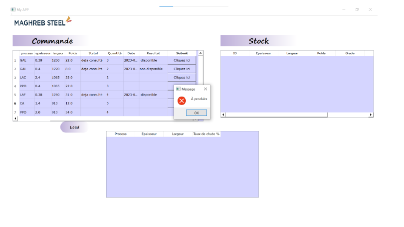

# Application de Calcul du Taux de Chute des Bobines

Cette application de bureau permet de calculer le taux de chute des bobines. Le taux de chute des bobines est un paramètre important dans de nombreux domaines industriels, notamment dans la production et la manipulation de matériaux en rouleaux.

Voici la page de connexion de notre application. L’administrateur introduit son nom d’utilisateur et son mot de passe. La figure ci-joint représente l’activité d’authentification

Si le nom d’utilisateur ou le mot de passe est erroné le système notifiéé l’administrateur par un message [User or Password invalid]

L’administrateur a le choix d’accéder soit à la page des commandes soit de consulter le stock.

Si l’administrateur a choisi de consulter le stock global, il doit télécharger la liste des produits de site MT.
Après téléchargement le système affiche la lise globale du stock depuis la base de données.

• L’administrateur a téléchargé toutes les listes des commandes depuis la base de données lorsqu’il clique sur bouton Load.

Quand l’administrateur clique sur la première commande le système signale que cette commande est consultée dans une date de consultation, et après une vérification de la disponibilité le système affiche tous les produits ayant respecté les dimensions demandées par le client puis il compare le nombre du produits Disponibles avec la quantité souhaiter par le client, enfin le système marque que cette commande soit disponible ou non.

• L’administrateur choisit un ou plusieurs produit(s) dans le stock ça dépend la quantité de chaque commande.
• Le choix se basé sur les produits ayant les valeurs de taux de chute plus optimisé dans chaque ligne de production.
• Le système est noté que ce produit est réservé pour la commande correspondante.
• Après le choix des produits dans le stock, le système affiche la planification du produit fini avec les dimensions de sortie dans chaque ligne de production.

Si l’administrateur a choisi une commande mais après une vérification de la disponibilité le système n’arrive pas à trouver aucun produit dans le stock qui respecte ces conditions, ce dernier notifie l’admin par un message d’erreur « A produire ».

## Fonctionnalités

- **Calcul du Taux de Chute:** L'application permet de saisir les paramètres nécessaires pour calculer le taux de chute des bobines, y compris le poids de la bobine, le diamètre initial, le diamètre final, etc.

- **Affichage des Résultats:** Une fois que les données sont saisies, l'application affiche le taux de chute calculé, permettant aux utilisateurs de prendre des décisions éclairées en matière de manipulation des bobines.
- **Convivialité:** L'interface utilisateur est conviviale et intuitive, ce qui permet une utilisation aisée par les opérateurs et les professionnels du domaine.

## Fonctionnalités

- **Calcul du Taux de Chute:** L'application permet de saisir les paramètres nécessaires pour calculer le taux de chute des bobines, y compris le poids de la bobine, le diamètre initial, le diamètre final, etc.
- **Affichage des Résultats:** Une fois que les données sont saisies, l'application affiche le taux de chute calculé, permettant aux utilisateurs de prendre des décisions éclairées en matière de manipulation des bobines.
- **Convivialité:** L'interface utilisateur est conviviale et intuitive, ce qui permet une utilisation aisée par les opérateurs et les professionnels du domaine.

## Utilisation

1. **Installation :** Clonez ou téléchargez le dépôt sur votre machine locale.
2. **Configuration :** Assurez-vous d'avoir les dépendances nécessaires installées sur votre système.
3. **Exécution :** Lancez l'application et suivez les instructions à l'écran pour calculer le taux de chute des bobines.

## Auteurs

Cette application a été développée par Adnan Ifrah et Soumia Tamrani.

## Remerciements

Nous tenons à remercier Maghreb Steel pour son soutien et ses ressources dans le développement de cette application.
